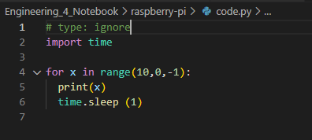

# Engineering_4_Notebook

&nbsp;

## Table of Contents
* [Raspberry_Pi_Assignment_Template](#Raspberry_Pi_Assignment_Template)
* [Onshape_Assignment_Template](#Onshape_Assignment_Template)
* [Launch part 1](#Launch_Part_1)
&nbsp;
## Laund_part_1
### Assigment Description
Write your assignment description here. What is the purpose of this assignment? It should be at least a few sentences.
### Evidence

### Wiring
I didn't use any wiring for this assisment
### Code
import time

for x in range(10,0,-1):
  print(x) 
  time.sleep (1)

### Reflection
I was confused at the beginning and tried to do assinment 1 and 2 at once. So I don't fully know if i did the assigment properly, I know for sure that I didn't do assinment two properly though.
## Raspberry_Pi_Assignment_Template

### Assignment Description

Write your assignment description here. What is the purpose of this assignment? It should be at least a few sentences.

### Evidence 

Pictures / Gifs of your work should go here. You need to communicate what your thing does. 

### Wiring

This may not be applicable to all assignments. Anything where you wire something up, include the wiring diagram here. The diagram should be clear enough that I can recreate the wiring from scratch. 

### Code
Give me a link to your code. [Something like this](https://github.com/millerm22/Engineering_4_Notebook/blob/main/Raspberry_Pi/hello_world.py). Don't make me hunt through your folders, give me a nice link to click to take me there! Remember to **COMMENT YOUR CODE** if you want full credit. 

### Reflection

What went wrong / was challenging, how'd you figure it out, and what did you learn from that experience? Your goal for the reflection is to pass on knowledge that will make this assignment better or easier for the next person. Think about your audience for this one, which may be "future you" (when you realize you need some of this code in three months), me, or your college admission committee!

&nbsp;

## Onshape_Assignment_Template

### Assignment Description

First assinment of the year and it was prettyu simple but I overcomplicated it at times and all you had to do was make a Pico countdown 

### Part Link 

[Create a link to your Onshape document](https://cvilleschools.onshape.com/documents/003e413cee57f7ccccaa15c2/w/ea71050bb283bf3bf088c96c/e/c85ae532263d3b551e1795d0?renderMode=0&uiState=62d9b9d7883c4f335ec42021). Don't forget to turn on link sharing in your Onshape document so that others can see it. 

### Part Image

Take a nice screenshot of your Onshape document. 

### Reflection

What went wrong / was challenging, how'd you figure it out, and what did you learn from that experience? Your goal for the reflection is to pass on knowledge that will make this assignment better or easier for the next person. Think about your audience for this one, which may be "future you" (when you realize you need some of this code in three months), me, or your college admission committee!

&nbsp;

## Media Test
  [Hyperlink text](raspberry-pi/temp.py)
### Test Link

### Test Image
   

### Test GIF

