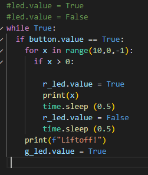
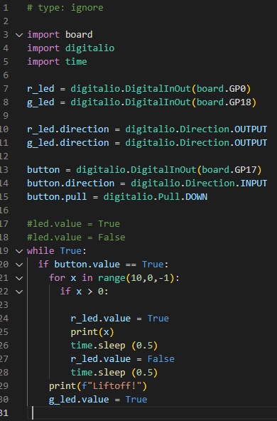
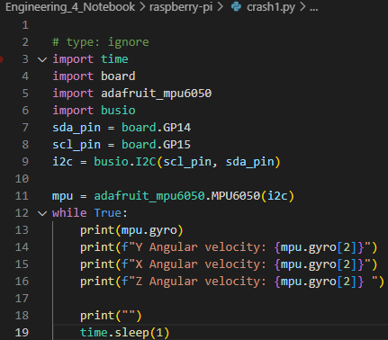
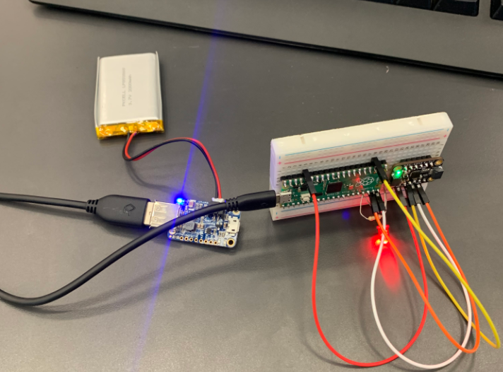

# Engineering_4_Notebook

&nbsp;

## Table of Contents
* [Raspberry_Pi_Assignment_Template](#Raspberry_Pi_Assignment_Template)
* [Onshape_Assignment_Template](#Onshape_Assignment_Template)
* [Launch part 1](#Launch_Part_1)
* [Launch part 2](#Launch_Part_2)
* [Launch part 3](#Launch_Part_3)
* [Crash avoidance 1](#Crash_avoidance_part_1)
* [Crash avoidance 2](#Crash_avoidance_part_2)
* [Crash avoidance 3](#Crash_avoidance_part_3)
&nbsp;
## Launch_part_1
### Assignment Description
Write your assignment description here. What is the purpose of this assignment? It should be at least a few sentences.
### Evidence

### Wiring
I didn't use any wiring for this assisment
### Code
import time

for x in range(10,0,-1):
  print(x) 
  time.sleep (1)

### Reflection
I was confused at the beginning and tried to do assignment 1 and 2 at once. So I don't fully know if i did the assigment properly, I know for sure that I didn't do assinment two properly though.
## Launch_Part_2
### Assignment Description
In this assignment we had make the Pico count and everytime the seocnd went down a red ligfht would blink. Once the countdown ended a green light would turn on to indicate the end.
### Evidence
 
### Wiring
r_led = digitalio.DigitalInOut(board.GP0)
g_led = digitalio.DigitalInOut(board.GP18)
### Code
if button.value == True:
    for x in range(10,0,-1):
      if x > 0:

        r_led.value = True
        print(x) 
        time.sleep (0.5)
        r_led.value = False
        time.sleep (0.5)
    print(f"Liftoff!")
    g_led.value = True 
 
### Reflection
The assignment made sense to me once I was about half way through it, before that I had no clue what I was doing. It was an easy thing to do but I still didn't finish it, I got the breadboard and lights and ect. in the right places but I couldn't figure out the code.
## Launch_Part_3
### Assignment Description
With this assigmne twe have to push a button and after that the lights blink and the serial monitor counts. It really is just a combination of the first two assigmnets just add a button to it.  
### Evidence
 
### Wiring
r_led = digitalio.DigitalInOut(board.GP0)
g_led = digitalio.DigitalInOut(board.GP18)
button = digitalio.DigitalInOut(board.GP17)
### Code
import board
import digitalio
import time

r_led = digitalio.DigitalInOut(board.GP0)
g_led = digitalio.DigitalInOut(board.GP18)

r_led.direction = digitalio.Direction.OUTPUT 
g_led.direction = digitalio.Direction.OUTPUT

button = digitalio.DigitalInOut(board.GP17)
button.direction = digitalio.Direction.INPUT 
button.pull = digitalio.Pull.DOWN

#led.value = True
#led.value = False
while True:
  if button.value == True:
    for x in range(10,0,-1):
      if x > 0:

        r_led.value = True
        print(x) 
        time.sleep (0.5)
        r_led.value = False
        time.sleep (0.5)
    print(f"Liftoff!")
    g_led.value = True 
 
### Reflection
Actually a pretty difficult assigmnet, I got mixed up in all the other ones but this one made the most sense. 
## Crash_avoidance_1
### Assignment Description
In this assigment we had to make an accelerometer continously report the X Y Z values.
### Evidence 
 
### Wiring 
sda_pin = board.GP14
scl_pin = board.GP15
### Code

import time
import board
import adafruit_mpu6050 
import busio
sda_pin = board.GP14
scl_pin = board.GP15
i2c = busio.I2C(scl_pin, sda_pin)

mpu = adafruit_mpu6050.MPU6050(i2c)
while True:
    print(mpu.gyro)
    print(f"Y Angular velocity: {mpu.gyro[2]}")
    print(f"X Angular velocity: {mpu.gyro[2]}")
    print(f"Z Angular velocity: {mpu.gyro[2]} ")

    print("")
    time.sleep(1)
### Reflection
It actually wasn't a hard assigment, I got the hang of it quickly and completed it with ease.
## Crash_avoidance_2
### Assignment Description
For this assignment you have to make the X Y Z values continuosly show and after that when the breadboard is tilted 90 degrees in any direction an LED must turn on indicating that it's turned
### Evidence

### Wiring
sda_pin = board.GP14
scl_pin = board.GP15
i2c = busio.I2C(scl_pin, sda_pin)
r_led = digitalio.DigitalInOut(board.GP13)
### Code
import time
import board
import adafruit_mpu6050 
import busio
import digitalio
sda_pin = board.GP14
scl_pin = board.GP15
i2c = busio.I2C(scl_pin, sda_pin)
r_led = digitalio.DigitalInOut(board.GP13)
r_led.direction = digitalio.Direction.OUTPUT 
mpu = adafruit_mpu6050.MPU6050(i2c)
while True:
    print(mpu.gyro)
    print(f"Y Angular velocity: {mpu.acceleration[1]}")
    print(f"X Angular velocity: {mpu.acceleration[0]}")
    print(f"Z Angular velocity: {mpu.acceleration[2]} ")

    print("")
    time.sleep(1)
    #led.value = True
    if mpu.acceleration[0]>8.5:
        r_led.value = True
        time.sleep(0.5)
        r_led.value = False
        
    if mpu.acceleration[0]<-8.5:
        r_led.value = True
        time.sleep(0.5)
        r_led.value = False
    if mpu.acceleration[1]>9:
        r_led.value = True
        time.sleep(0.5)
        r_led.value = False
    if mpu.acceleration[1]<-9:
        r_led.value = True
        time.sleep(0.5)
        r_led.value = False

### Reflection
Wasn't as hard as I expected it to be and it was probably my favorite assignment so far.
## Raspberry_Pi_Assignment_Template

### Assignment Description

Write your assignment description here. What is the purpose of this assignment? It should be at least a few sentences.

### Evidence 

Pictures / Gifs of your work should go here. You need to communicate what your thing does. 

### Wiring

This may not be applicable to all assignments. Anything where you wire something up, include the wiring diagram here. The diagram should be clear enough that I can recreate the wiring from scratch. 

### Code
Give me a link to your code. [Something like this](https://github.com/millerm22/Engineering_4_Notebook/blob/main/Raspberry_Pi/hello_world.py). Don't make me hunt through your folders, give me a nice link to click to take me there! Remember to **COMMENT YOUR CODE** if you want full credit. 

### Reflection

What went wrong / was challenging, how'd you figure it out, and what did you learn from that experience? Your goal for the reflection is to pass on knowledge that will make this assignment better or easier for the next person. Think about your audience for this one, which may be "future you" (when you realize you need some of this code in three months), me, or your college admission committee!

&nbsp;

## Onshape_Assignment_Template

### Assignment Description

First assinment of the year and it was prettyu simple but I overcomplicated it at times and all you had to do was make a Pico countdown 

### Part Link 

[Create a link to your Onshape document](https://cvilleschools.onshape.com/documents/003e413cee57f7ccccaa15c2/w/ea71050bb283bf3bf088c96c/e/c85ae532263d3b551e1795d0?renderMode=0&uiState=62d9b9d7883c4f335ec42021). Don't forget to turn on link sharing in your Onshape document so that others can see it. 

### Part Image

Take a nice screenshot of your Onshape document. 

### Reflection

What went wrong / was challenging, how'd you figure it out, and what did you learn from that experience? Your goal for the reflection is to pass on knowledge that will make this assignment better or easier for the next person. Think about your audience for this one, which may be "future you" (when you realize you need some of this code in three months), me, or your college admission committee!

&nbsp;

## Media Test
  [Hyperlink text](raspberry-pi/temp.py)
### Test Link

### Test Image
   

### Test GIF

